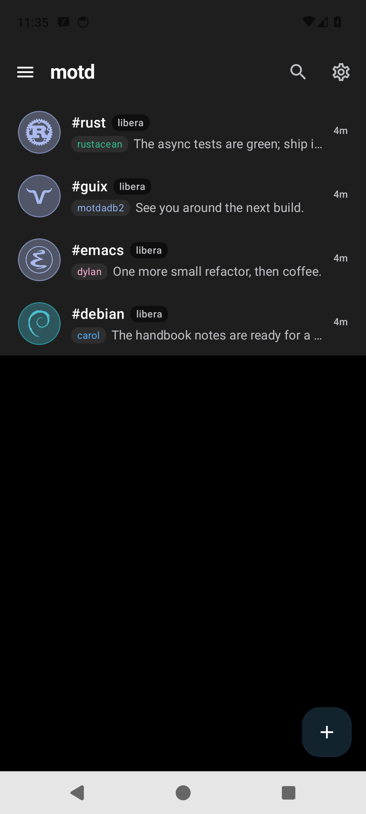
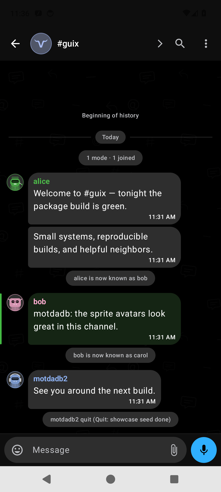
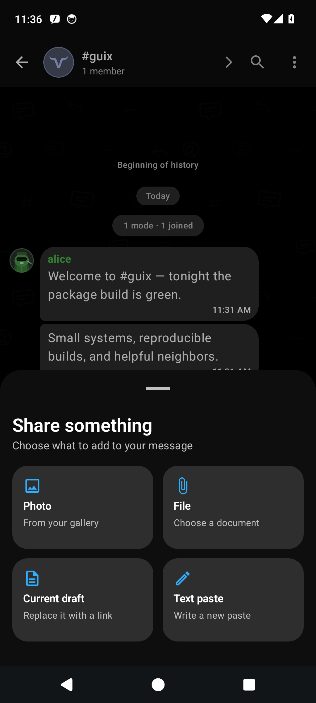

<p align="center">
  <picture>
    <source media="(prefers-color-scheme: dark)" srcset="docs/assets/brand/motd-lockup-dark.svg">
    
  </picture>
</p>

# motd

motd is a native Android IRC client with a Telegram-style chat UI, built in
Kotlin with Jetpack Compose and Material 3. It speaks IRCv3 and works best
paired with a [soju](https://soju.im) bouncer, but connects fine to plain
networks too.

When connected through a bouncer, motd detects capabilities over CAP and turns
them on automatically: infinite scrollback (`draft/chathistory`), cross-device
read state (`draft/read-marker`), several networks over one account
(`soju.im/bouncer-networks`), and push (`soju.im/webpush` + UnifiedPush). On a
plain network it falls back to local-only history and a persistent socket.

## Screenshots

The public [landing page](https://trevs.site/motd/) shows the same
deterministic app captures kept in [`screenshots/`](screenshots/). Refresh all
three frames with the isolated, headless fixture—no physical device or live
IRC account is needed:

```sh
nix develop -c ./test/e2e/headless.sh showcase
```

<table>
  <tr>
    <td align="center"><strong>Chat list</strong></td>
    <td align="center"><strong>Conversation</strong></td>
    <td align="center"><strong>File uploader</strong></td>
  </tr>
  <tr>
    <td><a href="screenshots/chat-list.png"></a></td>
    <td><a href="screenshots/chat.png"></a></td>
    <td><a href="screenshots/file-uploader.png"></a></td>
  </tr>
</table>

## Features

| Feature | Description |
|---|---|
| Chat UI | Unified chat list with unread/mention badges; grouped bubbles, day separators, event pills, inline images, and OG link previews. |
| Composer | Nick autocomplete, replies (`+draft/reply`), reactions (`+draft/react`), typing (`+typing`), and slash commands (`/msg`, `/join` with keys, `/mode`, `/notice`, `/ctcp`, `/invite`, and more; unknown commands and `/raw` go straight to the server). |
| Search | FTS4 full-text search over history, global or scoped to one buffer, with deep-jump to the matched message. |
| Scrollback | Paging 3 backed by a `draft/chathistory` RemoteMediator; local-only fallback on plain networks. |
| Read state | `draft/read-marker` (MARKREAD) sync through a single `ConnectionManager` entry point. |
| Multi-network | `soju.im/bouncer-networks` (BOUNCER BIND): one root connection plus per-network child bindings. |
| Delivery | Persistent-socket foreground service, or UnifiedPush + `soju.im/webpush` with on-device RFC 8291 (aes128gcm) decryption. |
| Theming | Material You dynamic color, curated editor/terminal palettes, custom nick colors, and refined generated chat wallpapers. |
| Transport | okio over `SSLSocket`, SASL PLAIN/EXTERNAL, client certificates via Android KeyChain, IRCv3 STS pinning. |

Requires Android 8.0 (API 26) or newer.

## Building and testing

GitHub Actions defines the canonical CI jobs (see
[`.github/workflows/`](.github/workflows/)). For local work, the Nix flake
provides JDK 21 and the Android SDK; direnv loads it via `.envrc`, or run
commands under `nix develop`.

The full build, lint, and test command reference lives in
[docs/human-developing.md](docs/human-developing.md). Quick start:

```sh
git submodule update --init --recursive
nix develop -c ./gradlew :app:assembleDebug      # Google-free arm64 debug APK
```

There is a single, Google-free build. Push delivery is UnifiedPush only — see
[ntfy and UnifiedPush setup](docs/ntfy-push.md).

The debug APK lands under `app/build/outputs/apk/debug/`. Install it with
`adb install`. The debug build carries the `.debug` application-id suffix, so
it can coexist with a release install.

The embedded VLESS + REALITY transport uses bundled libbox, which is currently
arm64-v8a-only. APKs built from this source tree must not be installed on 32-bit
ARM or x86 devices. Other ABI support needs a separately pinned and verified
libbox artifact.

## F-Droid packaging

motd is packaged in fdroiddata as `io.github.trevarj.motd`. F-Droid removes the
checked-in libbox AAR before scanning, then rebuilds libbox from the pinned
sing-box, Android-submodule, and gomobile sources. The build recipe and signing
model are in [docs/fdroid.md](docs/fdroid.md); what happens on each new release,
and the cases that still need a hand-written metadata change, are in
[docs/human-fdroid-update.md](docs/human-fdroid-update.md).

F-Droid builds retain the arm64-v8a-only embedded transport. F-Droid publishes
the upstream-signed APK once its own source rebuild reproduces it, so a GitHub
install and an F-Droid install share the same signing key and update each other
without a reinstall.

## Connecting

On first launch the empty chat list routes you to onboarding. Add a network and
connect.

To connect directly to Libera.Chat:

- Host `irc.libera.chat`, port `6697`, TLS on
- A nick, and SASL PLAIN with your NickServ credentials (or SASL NONE)

To connect through a soju bouncer, point the network at your bouncer's host and
port and authenticate with your bouncer account. motd then negotiates bouncer
capabilities and, with `soju.im/bouncer-networks`, manages your upstream
networks from a single connection.

For a CLoak bouncer, follow the dedicated [CLoak connection guide](docs/cloak.md).

For SOCKS5, Tor, or VLESS + REALITY configuration, see the
[obfuscation guide](docs/obfuscation.md).

## Architecture and docs

See [ARCHITECTURE.md](ARCHITECTURE.md). Human runbooks for building, testing,
releasing, and F-Droid updates are indexed in [docs/README.md](docs/README.md).

## License

Copyright 2026 Trevor Arjeski. motd is licensed under the GNU General Public
License, version 3 or (at your option) any later version; see
[LICENSE](LICENSE). Third-party licensing and libbox source provenance are
recorded in [THIRD_PARTY_NOTICES.md](THIRD_PARTY_NOTICES.md).

## Community

Questions, bug reports, and feedback: join `#motd` on
[Libera.Chat](https://libera.chat) (`irc.libera.chat`).

## Releasing

Releases are cut by pushing a signed `v*` tag. The tag workflow runs FOSS
release-parity tests and lint, then builds and signs the FOSS APK. `versionName`
and `versionCode` come from `gradle.properties`; the workflow requires the
signed tag to match `v<versionName>`. This keeps the upstream-signed APK
reproducible by F-Droid without changing its update-compatible signing key.

The full preflight, version-bump, tagging, dry-run, and failure-recovery steps
are in [docs/human-releasing.md](docs/human-releasing.md). Agent-facing release
policy lives in [`.agents/releases.md`](.agents/releases.md).

The managed-device smoke and exhaustive emulator journey remain available as
separate workflows, but currently do not gate releases because hosted emulator
System UI failures can occur before motd starts.

## LLM disclaimer

This project has been developed with assistance from large language models.
LLM-generated contributions are reviewed, tested, and maintained by the project
maintainer, who remains responsible for the published code and releases.
